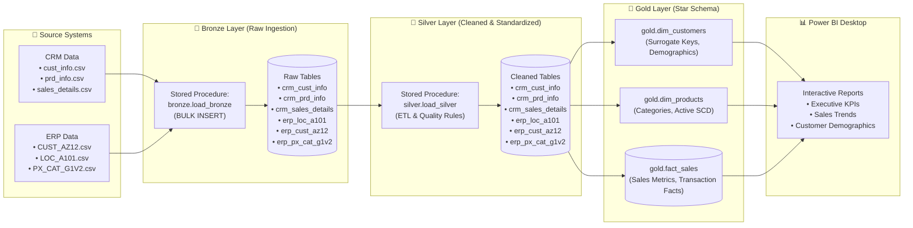

# Modern Enterprise SQL Data Warehouse & Power BI Analytics

[](https://www.microsoft.com/sql-server)
[](https://powerbi.microsoft.com)

---

## 📌 Project Overview

This project delivers an end-to-end **Enterprise Data Warehousing & Business Intelligence (BI)** solution built with **Microsoft SQL Server** as the primary data warehouse engine and visualized using **Power BI Desktop**. 

The warehouse ingests raw data from disparate source systems (**CRM** and **ERP**), standardizes and cleanses it using robust T-SQL stored procedures, models it into a high-performance **Star Schema** within the **Gold Layer**, and delivers executive reporting in **Power BI Desktop**.

---

## 🛠️ Tech Stack & Tools

| Category | Technology / Tool | Purpose & Usage |
|:---|:---|:---|
| **Database Engine** | **Microsoft SQL Server (2019+)** | Primary Relational Data Warehouse hosting `bronze`, `silver`, and `gold` schemas |
| **Database Management** | **SQL Server Management Studio (SSMS)** / Azure Data Studio | Environment for query execution, stored procedure development, and performance analysis |
| **Query & Transformation** | **Transact-SQL (T-SQL)** | DDL schema creation, `BULK INSERT` data loads, advanced transformations, CTEs, Window Functions, and `TRY...CATCH` error handling |
| **Data Modeling** | **Dimensional Modeling (Star Schema)** | Facts (`fact_sales`) and Dimensions (`dim_customers`, `dim_products`) with surrogate keys |
| **BI & Analytics** | **Microsoft Power BI Desktop** | Semantic modeling, DAX measures, and interactive KPI / executive dashboard reports connected to the Gold layer |

---

## 🏗️ Architecture & Data Pipeline (Medallion Architecture)

The warehouse follows the industry-standard **Medallion Architecture**, separating data processing into three distinct tiers:



---

## 🗂️ Warehouse Layers Explained

### 1. 🥉 Bronze Layer (Raw Ingestion)
- **Role:** Direct landing zone for source data ingested from CSV extracts.
- **Implementation:** 
  - Tables created with [ddl_bronze.sql](file:///Users/akarshanrasyal/Projects/Projects/sql-data-warehouse-project-main/scripts/bronze/ddl_bronze.sql) matching source structures.
  - Ingestion orchestrated via [proc_load_bronze.sql](file:///Users/akarshanrasyal/Projects/Projects/sql-data-warehouse-project-main/scripts/bronze/proc_load_bronze.sql) using `BULK INSERT`.
  - Includes automated truncation, execution duration tracking, and error handling (`TRY...CATCH`).

### 2. 🥈 Silver Layer (Cleansing & Standardization)
- **Role:** Sanitizes, deduplicates, and standardizes data for analytical readiness.
- **Key Transformations ([proc_load_silver.sql](file:///Users/akarshanrasyal/Projects/Projects/sql-data-warehouse-project-main/scripts/silver/proc_load_silver.sql)):**
  - **Deduplication:** Window functions (`ROW_NUMBER() OVER (PARTITION BY cst_id ORDER BY cst_create_date DESC)`) to retain the latest customer records.
  - **Data Hygiene:** `TRIM()` applied across text fields; leading prefix removals (`NAS` in customer IDs).
  - **Code Normalization:** Standardized marital status (`M` → `Married`, `S` → `Single`), gender (`M`/`F` → `Male`/`Female`), product lines, and country codes (`US`/`USA` → `United States`, `DE` → `Germany`).
  - **Integrity Fixes:** Handled negative or missing sales/price calculations (`sls_sales = sls_quantity * price`); sanitized invalid date integers to standard SQL `DATE`.
  - **SCD Tracking:** Derived dimension start and end dates using `LEAD()` window functions.
  - **Audit Metadata:** System column `dwh_create_date DATETIME2 DEFAULT GETDATE()` added to all tables.

### 3. 🥇 Gold Layer (Star Schema & Business Analytics)
- **Role:** Business-ready dimensional views optimized for BI and reporting.
- **Data Model ([ddl_gold.sql](file:///Users/akarshanrasyal/Projects/Projects/sql-data-warehouse-project-main/scripts/gold/ddl_gold.sql)):**
  - **`gold.dim_customers`**: Enriched customer master with joined demographic and geographic attributes from both CRM and ERP sources, assigned surrogate key `customer_key`.
  - **`gold.dim_products`**: Cleaned product master mapped to category hierarchies, filtered for active product records (`prd_end_dt IS NULL`), assigned surrogate key `product_key`.
  - **`gold.fact_sales`**: Granular transactional sales table linked to dimensions through surrogate keys (`customer_key`, `product_key`).

```
              ┌───────────────────────────┐
              │    gold.dim_customers     │
              ├───────────────────────────┤
              │ PK  customer_key          │
              │     customer_id           │
              │     customer_number       │
              │     first_name, last_name │
              │     country               │
              │     marital_status        │
              │     gender, birthdate     │
              └─────────────┬─────────────┘
                            │ 1
                            │
                            │ *
┌───────────────────────────┴─────────────┐         ┌───────────────────────────┐
│             gold.fact_sales             │         │     gold.dim_products     │
├─────────────────────────────────────────┤         ├───────────────────────────┤
│     order_number                        │       * │ PK  product_key           │
│ FK  customer_key ───────────────────────┼─────────┤     product_id            │
│ FK  product_key  ───────────────────────┼─────────┤     product_number        │
│     order_date, shipping_date, due_date │       1 │     product_name          │
│     sales_amount                        │         │     category, subcategory │
│     quantity, price                     │         │     cost, product_line    │
└─────────────────────────────────────────┘         └───────────────────────────┘
```

---

## 📊 Power BI Desktop Analytics

A **Power BI Desktop** dashboard was created connecting directly to the **Gold Layer** (`DataWarehouse.gold`), unlocking actionable business intelligence:

### 🌟 Key Power BI Capabilities & Implementation:
1. **Star Schema Data Modeling:** 
   - Direct 1-to-many single-directional relationships established between `dim_customers` → `fact_sales` and `dim_products` → `fact_sales`.
2. **Core Metrics & DAX Measures:**
   - **Total Revenue / Sales**: `SUM(fact_sales[sales_amount])`
   - **Total Units Sold**: `SUM(fact_sales[quantity])`
   - **Average Order Value (AOV)**: `[Total Sales] / DISTINCTCOUNT(fact_sales[order_number])`
   - **Profit Margin & Cost Analysis**: Evaluated against `dim_products[cost]`.
3. **Interactive Dashboards & Reports:**
   - **Executive KPI Overview:** Top-level revenue, volume, and order performance.
   - **Sales Trend Analysis:** Monthly, quarterly, and seasonal patterns across ordering and shipping dates.
   - **Product Line Performance:** Category and subcategory revenue breakdown and maintenance indicators.
   - **Customer & Geographic Demographics:** Customer distribution across countries, gender, and marital status.

---

## 🧪 Data Quality & Validation Tests

The project includes SQL test suites to guarantee data integrity across layers:

- **Silver Layer Checks ([quality_checks_silver.sql](file:///Users/akarshanrasyal/Projects/Projects/sql-data-warehouse-project-main/tests/quality_checks_silver.sql)):**
  - Validation of primary key uniqueness and non-null constraints.
  - Detection of untrimmed whitespaces.
  - Validation of chronological order (`order_date <= shipping_date` and `start_date <= end_date`).
  - Verification of mathematical consistency (`sales = quantity * price`).
- **Gold Layer Checks ([quality_checks_gold.sql](file:///Users/akarshanrasyal/Projects/Projects/sql-data-warehouse-project-main/tests/quality_checks_gold.sql)):**
  - Uniqueness validation for surrogate keys (`customer_key`, `product_key`).
  - Referential integrity check between `fact_sales` and dimensions (zero orphan records).

---

## 📁 Repository Structure

```plaintext
.
├── datasets/                               # Source CSV datasets
│   ├── source_crm/                         # CRM data extracts (cust_info, prd_info, sales_details)
│   └── source_erp/                         # ERP data extracts (CUST_AZ12, LOC_A101, PX_CAT_G1V2)
├── docs/                                   # Project documentation
│   ├── data_catalog.md                     # Data dictionary for Gold layer objects
│   └── naming_conventions.md               # Standards for tables, columns, and procedures
├── scripts/                                # Database initialization and ETL scripts
│   ├── init_database.sql                   # Database & schema creation (bronze, silver, gold)
│   ├── bronze/                             # Bronze layer DDL & ingestion procedure
│   │   ├── ddl_bronze.sql
│   │   └── proc_load_bronze.sql
│   ├── silver/                             # Silver layer DDL & transformation procedure
│   │   ├── ddl_silver.sql
│   │   └── proc_load_silver.sql
│   └── gold/                               # Gold layer Star Schema views
│       └── ddl_gold.sql
├── tests/                                  # Data quality check scripts
│   ├── quality_checks_silver.sql
│   └── quality_checks_gold.sql
└── README.md                               # Project documentation
```

---

## 🚀 Step-by-Step Setup & Execution Guide

### 1. Prerequisites
- **Microsoft SQL Server** (2019 or later) / **Azure SQL Database**
- **SQL Server Management Studio (SSMS)** or **Azure Data Studio**
- **Microsoft Power BI Desktop**

### 2. Database & Schema Initialization
Execute [scripts/init_database.sql](file:///Users/akarshanrasyal/Projects/Projects/sql-data-warehouse-project-main/scripts/init_database.sql) to create the `DataWarehouse` database and initialize `bronze`, `silver`, and `gold` schemas:
```sql
-- Creates database and schemas: bronze, silver, gold
:r ./scripts/init_database.sql
```

### 3. Build & Populate the Bronze Layer
1. Run [scripts/bronze/ddl_bronze.sql](file:///Users/akarshanrasyal/Projects/Projects/sql-data-warehouse-project-main/scripts/bronze/ddl_bronze.sql) to create bronze tables.
2. Compile [scripts/bronze/proc_load_bronze.sql](file:///Users/akarshanrasyal/Projects/Projects/sql-data-warehouse-project-main/scripts/bronze/proc_load_bronze.sql).
   > *Note: Update CSV file paths inside `proc_load_bronze.sql` to match your local filesystem path before running.*
3. Execute the bronze load procedure:
```sql
EXEC bronze.load_bronze;
```

### 4. Build & Populate the Silver Layer
1. Run [scripts/silver/ddl_silver.sql](file:///Users/akarshanrasyal/Projects/Projects/sql-data-warehouse-project-main/scripts/silver/ddl_silver.sql) to create silver tables.
2. Compile [scripts/silver/proc_load_silver.sql](file:///Users/akarshanrasyal/Projects/Projects/sql-data-warehouse-project-main/scripts/silver/proc_load_silver.sql).
3. Execute the silver transformation procedure:
```sql
EXEC silver.load_silver;
```
4. Run validation checks in [tests/quality_checks_silver.sql](file:///Users/akarshanrasyal/Projects/Projects/sql-data-warehouse-project-main/tests/quality_checks_silver.sql).

### 5. Build the Gold Layer (Star Schema)
Run [scripts/gold/ddl_gold.sql](file:///Users/akarshanrasyal/Projects/Projects/sql-data-warehouse-project-main/scripts/gold/ddl_gold.sql) to create the dimensional and fact views:
```sql
-- Run DDL script to generate Gold views
:r ./scripts/gold/ddl_gold.sql
```
Validate referential integrity and surrogate keys using [tests/quality_checks_gold.sql](file:///Users/akarshanrasyal/Projects/Projects/sql-data-warehouse-project-main/tests/quality_checks_gold.sql).

### 6. Connect to Power BI Desktop
1. Open **Power BI Desktop**.
2. Select **Get Data** → **SQL Server**.
3. Enter your Server Name and Database Name: `DataWarehouse`.
4. Select Data Connectivity mode (**Import** or **DirectQuery**).
5. From the Navigator, select the three Gold layer views:
   - `gold.dim_customers`
   - `gold.dim_products`
   - `gold.fact_sales`
6. Verify the relationships in Model view and start building your reports and DAX measures.

---

## 📖 Standards & Reference Documentation

- 📘 [Data Catalog Documentation](file:///Users/akarshanrasyal/Projects/Projects/sql-data-warehouse-project-main/docs/data_catalog.md) — Comprehensive schema definitions and column descriptions.
- 📐 [Naming Conventions](file:///Users/akarshanrasyal/Projects/Projects/sql-data-warehouse-project-main/docs/naming_conventions.md) — Standardized rules for tables, surrogate keys, and technical columns.

---

## 👨‍💻 Author
**Akarshan Rasyal**  
*SQL Data Warehouse & Business Intelligence Project*
